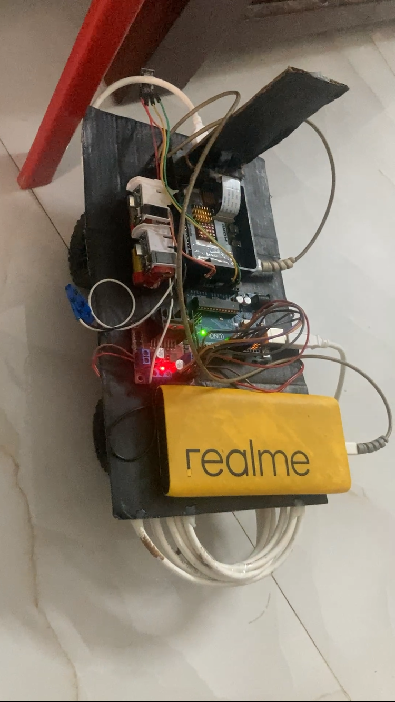

# Autonomous Mobile Robot with Edge Vision AI

<p align="center">
  
  
</p>

A prototype autonomous robot built using **Raspberry Pi, Arduino, camera, and AI**.

The robot uses a camera to understand its surroundings and make basic movement decisions such as **Forward, Left, Right, and Stop**. The Raspberry Pi handles the camera and AI communication, while the Arduino controls the motors and provides an additional obstacle-safety layer.

## Demo

🎥 **[Watch the Robot Demo](https://drive.google.com/file/d/1xpK_w8LSgmZxXxsrUBkDHlhaEYcxVQNN/view?usp=share_link)**

---

## How It Works

```text
Camera
   ↓
Raspberry Pi
   ↓
AI analyzes the image
   ↓
Forward / Left / Right / Stop
   ↓
Arduino
   ↓
Motors
```

The Arduino also uses a **VL53L0X distance sensor** to detect nearby obstacles.

```text
Obstacle < 30 cm
       ↓
Arduino
       ↓
Stop the robot
```

This allows the Arduino to stop the robot independently if an obstacle gets too close, even while the AI is processing the next image.

---

## What I Built

* Integrated a Raspberry Pi camera for capturing the environment.
* Connected the Raspberry Pi to a locally running Vision-Language Model (LLaVA).
* Converted AI decisions into simple movement commands.
* Built serial communication between the Raspberry Pi and Arduino.
* Implemented motor control using an Arduino and motor driver.
* Added a VL53L0X ToF sensor for obstacle detection.
* Added a safety stop when an obstacle is detected within 30 cm.
* Used Python `threading` and `queue` so AI processing does not completely stop robot movement.

---

## Technology Used

### Hardware

* Raspberry Pi 4
* Arduino Uno
* 5MP CSI Camera
* VL53L0X ToF Sensor
* DC Motors
* H-Bridge Motor Driver
* Battery + Buck Converter

### Software

* Python
* C++ / Arduino
* LLaVA
* Ollama
* Serial Communication
* Multithreading

---

## Project Architecture

The system has two main parts.

### Raspberry Pi

Handles:

* Camera input
* AI communication
* Navigation decisions
* Command queue
* Communication with Arduino

### Arduino

Handles:

* Motor control
* Distance sensor
* Obstacle detection
* Emergency stopping

This keeps the **AI processing separate from the low-level motor and safety control**.

---

## Key Challenge

One of the main challenges was **AI response time**.

The Vision-Language Model can take a few seconds to process an image. Instead of completely stopping the robot while waiting, I used Python **multithreading**.

One thread handles the AI processing while another handles the robot commands.

This allows the robot to keep moving slowly while the next AI decision is being processed.

---

## Current Status

### Phase 1 Completed

* Camera → AI → Arduino → Motors working
* AI-based movement commands working
* Obstacle detection working
* Safety stop implemented
* Raspberry Pi and Arduino communication working

---

## Future Improvements

* ROS2 integration
* Faster real-time object detection
* YOLO + TensorRT
* Better obstacle avoidance
* Motor encoders and movement feedback
* Improved navigation

---

## Project Goal

The goal of this project was to build a complete **AI + robotics system**, starting from camera input and AI decision-making and ending with real physical movement and obstacle safety.
